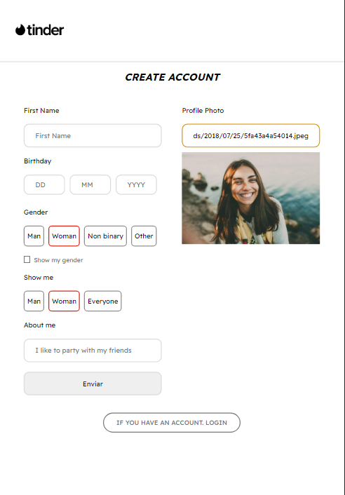
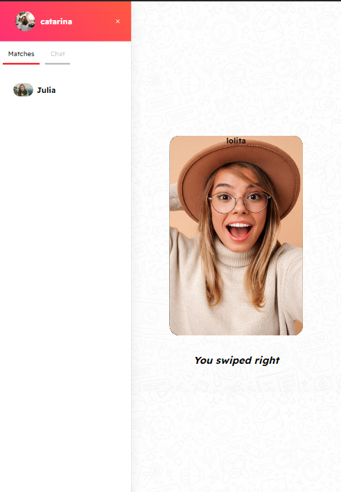
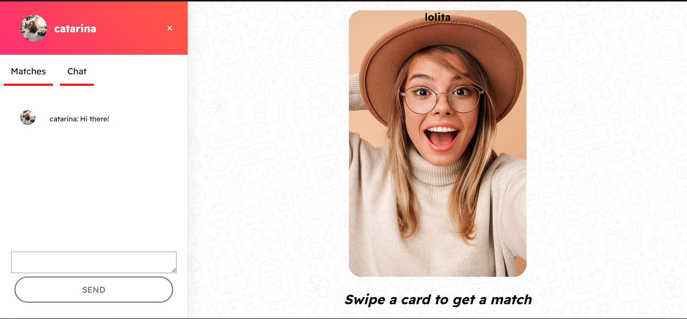

# Tinder Chat Simple Clone

This is a project of a tinder chat clone focused in the chat functionality.
It is not finished yet some features are still in building process.

## Contents

- [Overview](#overview)
  - [What it can do](#what-it-can-do)
  - [Screenshot](#screenshot)
- [My process](#my-process)
  - [Built with](#built-with)
  - [Available Scripts](#available-scripts)

### What it can do

- Sign Up, Login and Sign Out.
- Create your own profile
- Swipe and get matches.
- Start a new conversation with your date match

### Screenshot


 



## My process

### Built with

- [React](https://reactjs.org/) - ReactJS
- MongoDB Atlas
- CSS3 For styles
- NodeJS
- Express
- Axios

## Available Scripts

### Clone

```bash
   https://github.com/Fleemings/Tinder_Chat.git
```

### Install dependencies

#### Go to

```bash
    ./tinder-chat/client
```

## Frontend

```bash
   `npm install`
```

#### Go to

```bash
    ./tinder-chat/server
```

## Backend

```bash
   `npm install`
```

### Connect your database

- I have used MongoDB Atlas for this project. You can do the same to simple run it.

## Follow the steps

- Create an account
- Create your database: `app-data`
- Create the collections: `users` and `messages`
- Follow the data model describde bellow:

#### users collection

```bash
user_id: id
email: String
hashed_password: String
about: String
dob_day: String
dob_month: String
dob_year: String
first_name: String
gender_identity: String
gender_interest: String
matches: Array
show_gender: Boolean
url: String

```

#### messages collection

```bash
timestamp
"2022-01-01T18:28:40+00:00"
from_userId
"aaaa3505-a823-490a-99e0"
to_userId
"b2888eaa-11e0-4418-8ddb"
message
"hey there!"
```

- Allow network access to 0.0.0.0/0

### Update PORT config

- In case of change of port, to run the backend, update the file :

```bash
   ./client/config/index.js
   ./server/.env
```

### Start project

#### Frontend inside the client folder

```bash
   `npm start:frontend`
```

Open [http://localhost:3000](http://localhost:3000) to view it in your browser.

#### Backend inside the backend folder

```bash
   `npm start:backend`
```

New features and upgrade of the existing ones is coming soon

